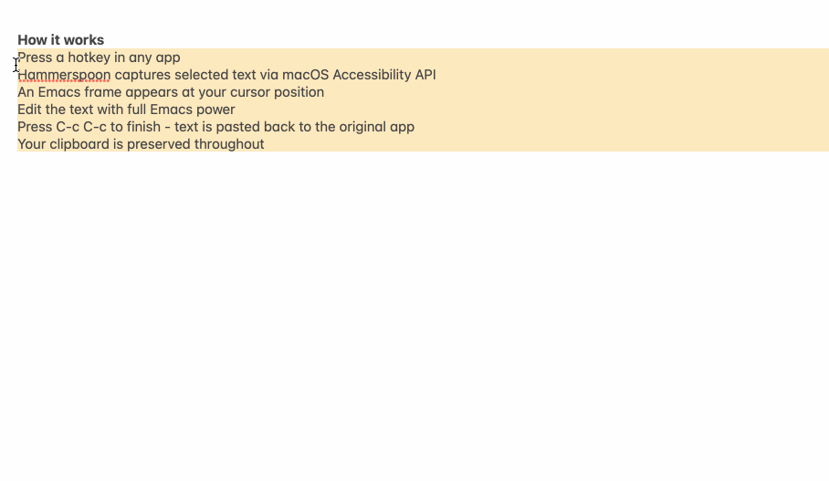

# emacs-anywhere

Edit text from any macOS application in Emacs.



> **Note:** This project is macOS-only by design. It is not intended to replace [emacs-everywhere](https://github.com/tecosaur/emacs-everywhere), but rather to provide a more reliable alternative for macOS users who have experienced issues with timing and race conditions.

## How it works

1. Press a hotkey in any app
2. Hammerspoon captures selected text via macOS Accessibility API
3. An Emacs frame appears at your cursor position
4. Edit the text with full Emacs power
5. Press `C-c C-c` to finish - text is pasted back to the original app
6. Your clipboard is preserved throughout

**Features:**
- Support opening multiple emacs-anywhere frames concurrently
- Works with both Emacs daemon mode and GUI Emacs with server-start

## Why not emacs-everywhere?

[emacs-everywhere](https://github.com/tecosaur/emacs-everywhere) is a great cross-platform solution, but on macOS it relies on AppleScript for system integration. This can lead to:

- **Timing issues**: Race conditions between copying text and opening Emacs
- **Unreliable text capture**: AppleScript's clipboard handling can be flaky
- **Focus problems**: Window focus doesn't always transfer correctly
- **Beep sounds**: Simulated `Cmd+C` beeps when nothing is selected

**emacs-anywhere** takes a different approach:

| | emacs-everywhere | emacs-anywhere |
|---|---|---|
| **Platform** | Cross-platform | macOS only |
| **System integration** | AppleScript (from Emacs) | Hammerspoon (Lua) |
| **Text capture** | Simulated `Cmd+C` | Accessibility API |
| **Logic lives in** | Emacs Lisp | Lua + minimal Elisp |
| **Dependencies** | None | Hammerspoon |

By using Hammerspoon and the native macOS Accessibility API, we get:

- **Direct text access**: Read selected text without touching the clipboard
- **No beeps**: Accessibility API doesn't trigger system sounds
- **Reliable timing**: Lua callbacks are predictable
- **Better focus control**: Hammerspoon has robust window management

The tradeoff is requiring Hammerspoon as a dependency, but if you're on macOS and want reliability over portability, this is the better choice.

## Requirements

- macOS
- [Hammerspoon](https://www.hammerspoon.org/) (with CLI tool installed)
- Emacs with server running:
  - Emacs daemon (`emacs --daemon` or via launchd), or
  - GUI Emacs with server mode (`M-x server-start`)

## Installation

### 1. Install Hammerspoon

Download from [hammerspoon.org](https://www.hammerspoon.org/) or via Homebrew:

```bash
brew install --cask hammerspoon
```

Grant Accessibility permission: **System Settings → Privacy & Security → Accessibility → enable Hammerspoon**

### 2. Install the Spoon

Clone this repository and symlink (or copy) the Spoon:

```bash
git clone https://github.com/nohzafk/emacs-anywhere.git
ln -s ~/path/to/emacs-anywhere/EmacsAnywhere.spoon ~/.hammerspoon/Spoons/
```

### 3. Configure Hammerspoon

Add to your `~/.hammerspoon/init.lua`:

```lua
-- Required for Emacs callback
require("hs.ipc")

-- Load and configure EmacsAnywhere
hs.loadSpoon("EmacsAnywhere")
spoon.EmacsAnywhere:bindHotkeys({
    toggle = {{"ctrl"}, "f8"}  -- Ctrl+F8
})
```

**Hotkey format:** `{modifiers, key}`

- Modifiers: `"cmd"`, `"ctrl"`, `"alt"`, `"shift"` (combine in a table)
- Key: any key name like `"f8"`, `"e"`, `"space"`, etc.

Examples:

```lua
toggle = {{"ctrl"}, "f8"}           -- Ctrl+F8
toggle = {{"cmd", "ctrl"}, "e"}     -- Cmd+Ctrl+E
toggle = {{"cmd", "shift"}, "e"}    -- Cmd+Shift+E
toggle = {{"alt"}, "e"}             -- Option+E
```

Reload Hammerspoon config (`Cmd+Ctrl+R` or from menu).

### 4. Start the Emacs server

**Option 1: Daemon mode**

Start Emacs as a background daemon:

```bash
# Manual start
/Applications/Emacs.app/Contents/MacOS/Emacs --daemon

# Or via launchd (starts at login, auto-restarts)
# See: https://github.com/nix-community/home-manager/blob/master/modules/launchd/launchd-agents.nix
```

**Option 2: GUI Emacs with server mode**

Add to your Emacs config:

```elisp
(server-start)
```

That's it! The Spoon automatically loads the elisp when needed.

## Usage

1. Select text in any application (optional - can start with empty buffer)
2. Press `Ctrl+F8` (or your configured hotkey)
3. Edit in Emacs - frame appears at cursor position
4. `C-c C-c` to finish and paste back
5. `C-c C-k` to abort without pasting

The header line shows the target app and available keybindings:

```text
→ Safari  |  C-c C-c: finish  |  C-c C-k: abort
```

## Configuration

### Hammerspoon

```lua
-- Custom emacsclient path (default: /opt/homebrew/bin/emacsclient)
spoon.EmacsAnywhere.emacsclient = "/usr/local/bin/emacsclient"

-- Custom temp directory (default: /tmp/emacs-anywhere)
spoon.EmacsAnywhere.tmpdir = "/tmp/my-emacs-anywhere"
```

### Emacs

The elisp is automatically loaded from the Spoon - no need to add anything to your `load-path`. To customize, just set these variables directly in your Emacs config:

```elisp
;; Custom frame size (position is overridden by mouse location)
(setq emacs-anywhere-frame-parameters
      '((name . "emacs-anywhere")
        (width . 80)
        (height . 20)))

;; Custom Hammerspoon CLI path (default: /opt/homebrew/bin/hs)
(setq emacs-anywhere-hs-path "/usr/local/bin/hs")

;; Custom major mode (default: text-mode)
(setq emacs-anywhere-major-mode #'markdown-mode)
```

These variables will be respected when the elisp is dynamically loaded.

#### Buffer customization via hook

Use `emacs-anywhere-mode-hook` to further customize the buffer:

```elisp
;; Enable spell checking
(add-hook 'emacs-anywhere-mode-hook #'flyspell-mode)

;; Enable visual line wrapping
(add-hook 'emacs-anywhere-mode-hook #'visual-line-mode)

;; Multiple customizations
(add-hook 'emacs-anywhere-mode-hook
          (lambda ()
            (setq-local fill-column 72)
            (auto-fill-mode 1)))
```

### Window Manager Integration

If you use a tiling window manager like yabai, add a rule to float the emacs-anywhere frame:

```bash
# ~/.config/yabai/yabairc
yabai -m rule --add app="Emacs" title="^emacs-anywhere" manage=off
```

## Troubleshooting

### "hs.ipc not loaded!"

Add `require("hs.ipc")` to your `~/.hammerspoon/init.lua` before loading the spoon.

### "Emacs server not running!"

Start the Emacs server with `M-x server-start` or add `(server-start)` to your config.

### Emacs frame doesn't appear

1. Check that `emacsclient` works:

   ```bash
   /opt/homebrew/bin/emacsclient -e '(+ 1 1)'  # Should print 2
   ```

2. Verify the path in Hammerspoon config matches your `emacsclient` location.

### Hammerspoon CLI not working

1. Test it:

   ```bash
   hs -c 'hs.alert.show("hello")'
   ```

2. If `hs` command not found, install it via Homebrew or add `hs.ipc.cliInstall()` to your config.

3. If you get "can't access message port", make sure `require("hs.ipc")` is in your config.

### No text captured from application

Some applications don't expose selected text via the Accessibility API. In these cases, the buffer will start empty - you can paste manually with `C-y`.

### Accessibility permissions

If Hammerspoon can't read selected text or simulate keystrokes:

1. Go to **System Settings → Privacy & Security → Accessibility**
2. Remove Hammerspoon from the list
3. Re-add it and grant permissions
4. Restart Hammerspoon

## How it works (technical details)

1. **Trigger**: Hammerspoon hotkey calls `EmacsAnywhere:start()`
2. **Capture**: Selected text is read via `AXSelectedText` accessibility attribute, app name and bundle ID are saved
3. **Temp file**: Text is written to `/tmp/emacs-anywhere/<app>-<timestamp>-<random>.txt`
4. **Emacs**: `emacsclient -n -c -e` evaluates `(emacs-anywhere-open ...)` with:
   - `-n`: Non-blocking, returns immediately (enables concurrent sessions)
   - `-c`: Creates GUI frame (establishes display context for daemon)
   - File path, app name (display), bundle ID (lookup), mouse coordinates
5. **Frame state**: Each frame stores its own state in frame parameters (not global variables)
6. **Edit**: Emacs configures the frame at mouse position and opens the temp file
7. **Finish**: `C-c C-c` saves file, calls `hs -c 'spoon.EmacsAnywhere:finish("<file>", "<bundle-id>")'`
8. **App lookup**: Hammerspoon finds target app by bundle ID (reliable, unique identifier)
9. **Paste**: Reads file, saves clipboard, pastes content via `Cmd+V`, restores clipboard
10. **Cleanup**: Temp file and frame are deleted

### Concurrent sessions

Multiple emacs-anywhere sessions can run simultaneously:
- Each session has its own temp file and frame
- Frame parameters store session-specific state (file path, app bundle ID)
- Sessions are independent and don't interfere with each other
- Closing one session doesn't affect others

## License

MIT
